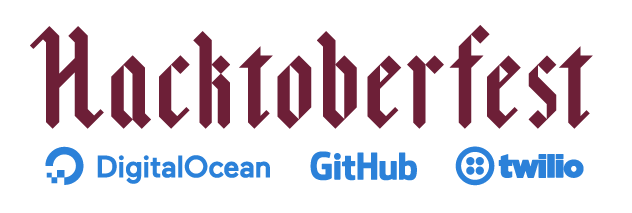

Making your first pull request to an open source project can seem like quite a daunting task. We're here to take some of the mytery out of the process.

This site was designed to accompany the [Leeds Hacktoberfest Open Hack Night 2018](https://www.eventbrite.co.uk/e/leeds-hacktoberfest-open-hack-night-tickets-50957618609). Check out the [Slides on Speakerdeck](https://speakerdeck.com/iwillspeak/opening-your-first-pull-request).